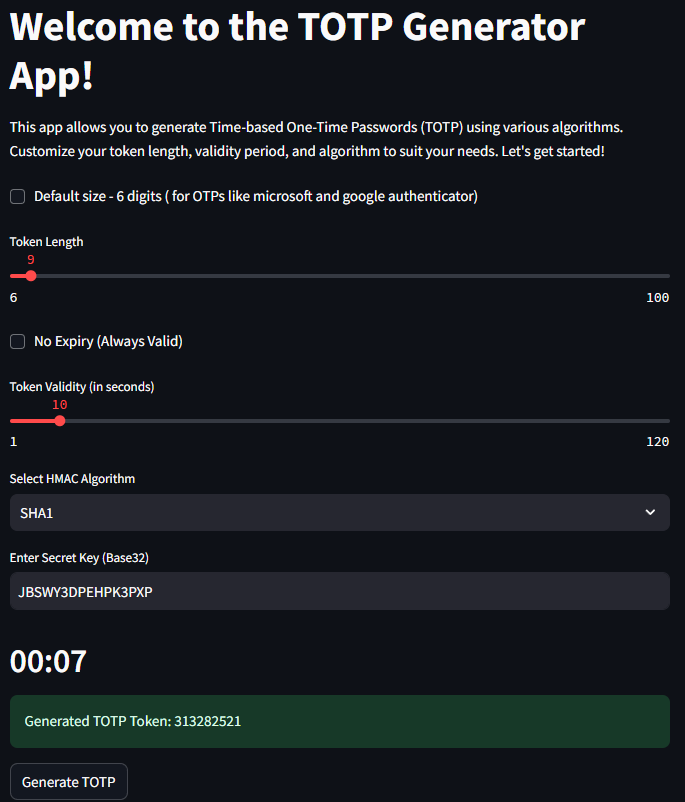

# TOTP Generator
This project implements a Time-based One-Time Password (TOTP) generator using different HMAC algorithms. TOTP is based on the HMAC-based One-Time Password (HOTP) algorithm and uses the current time as a counter to generate time-sensitive codes.

## A first look of the interface


## Try our TOTP generator here:
[Totp-generator Demo ](https://totp-generator.streamlit.app/)


### Algorithms Supported:

- **HMAC-SHA1**
- **HMAC-SHA256**
- **HMAC-SHA512**

## Installation

To use this script, you need to have Python 3 installed. You can install the required packages using `pip`:

```sh
pip install -r requirements.txt
```

## Usage

You can use this script from the command line to generate TOTP tokens. Here are the command-line options:

```
script.py [-h] -s SECRET [-a {SHA1,SHA256,SHA512}] [-l LENGTH] [-v VALIDITY]
```

## Example
Generate a TOTP token with SHA256 algorithm:

```sh
python script.py -s JBSWY3DPEHPK3PXP -a SHA256
```


# Web Interface
This project also includes a simple web interface built with Streamlit. You can generate 

TOTP tokens interactively by adjjusting token length, algorithm, and validity period.

## Features of the Web Interface:
- Token Length: Choose a token length between 6 to 100 digits.

- HMAC Algorithms: Select from SHA1, SHA256 or SHA512.

- Validity Period: Set the token's validity (in seconds), or choose infinite validity.

- Live Countdown: Displays a countdown timer until the TOTP token expires (unless infinite validity is selected).

## Running the Web Interface:
To launch the Streamlit interface:
```sh
streamlit run totp_app.py
```

## References
[RFC 6238: Specification of TOTP ](https://datatracker.ietf.org/doc/html/rfc6238)

[RFC 4226: Specification of HOTP](https://datatracker.ietf.org/doc/html/rfc4226)